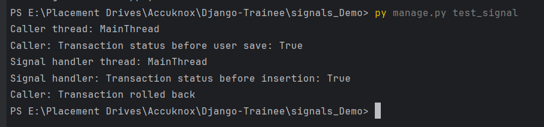
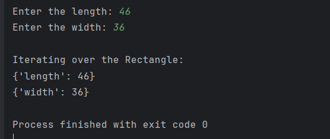

# Django Trainee  - Accuknox

## A) Topic - Django Signals
  This project demonstrates the behavior of Django signals, particularly:
Whether signals run in the same thread as the caller.
Whether signals execute in the same database transaction as the caller.The project uses the built-in SQLite database.

  

### Project Setup

#### Ensure you have the following installed:

Python 3.x

Django 4.x or later

1. **Clone the repository:**

   ```bash
   git clone <repository_url>
   ```
### OR

2. **Create Django Project**

You can install Django and start new project as follows:


```bash
pip install django
django-admin startproject signals_Demo
cd signals_Demo
python manage.py startapp users
```


3. **Add App to Installed Apps**
   1. Update INSTALLED_APPS in signal_demo/settings.py
      
      ```bash
      INSTALLED_APPS = [
      'django.contrib.admin',
      'django.contrib.auth',
      'django.contrib.contenttypes',
      'django.contrib.sessions',
      'django.contrib.messages',
      'django.contrib.staticfiles',
      'users',  # Add this line
      ]
      ```
 

   

4. **Set up Signals and make migrations :**
 
   1. Create a file in users/signals.py:
   2. Connect the signal in users/apps.py:
   3. Create a folder users/management/commands and add a file test_signal.py
   4. Apply migration
      
    ```bash
    python manage.py migrate
   ```
       
5. **Run the project**
   Use following command to run project 
   ```bash
    python manage.py test_signal
   ```

   

## B) Topic - Custom Classes in Python
Description: You are tasked with creating a Rectangle class with the following requirements:
1.An instance of the Rectangle class requires length:int and width:int to be initialized.
2.We can iterate over an instance of the Rectangle class
3.When an instance of the Rectangle class is iterated over, we first get its length in the format: {'length': <VALUE_OF_LENGTH>} followed by the width {width:
<VALUE_OF_WIDTH>}

Run following command:
 ```bash
    python Rectangle.py
 ```


Feel free to customize this README to provide more specific information about your project. Include any additional setup instructions, prerequisites, or specific details about your application that you think would be helpful for users.
